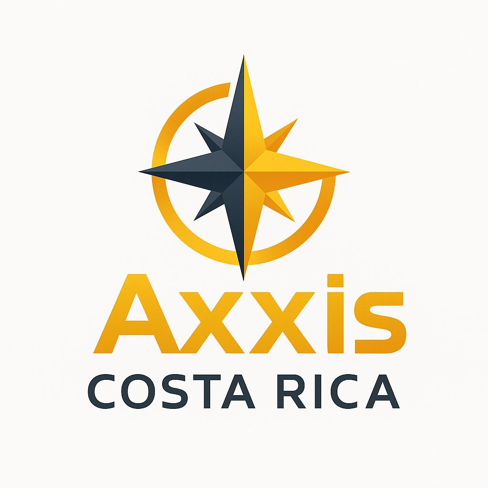
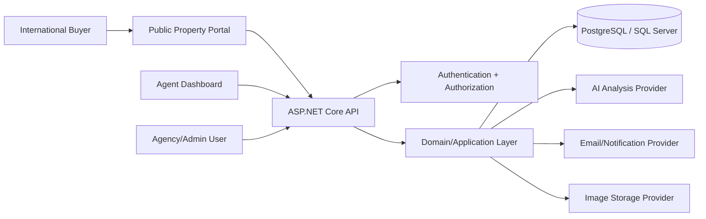
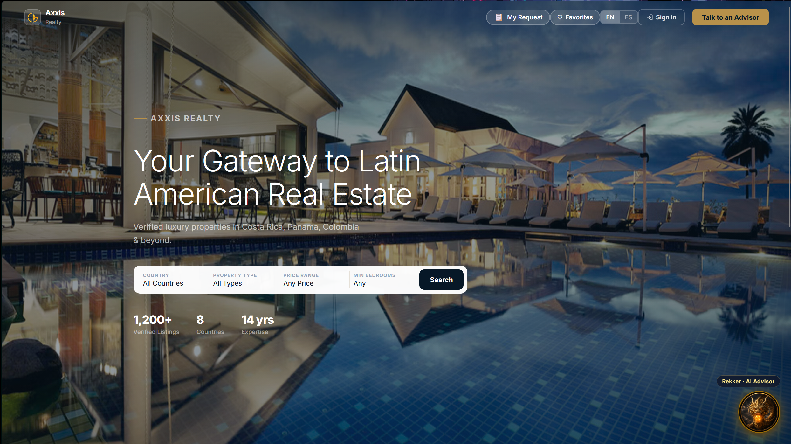

# SolPro Platform - Public Portfolio Case Study

SolPro Platform is a private full-stack SaaS project for premium real estate agencies, agents, property owners, and international buyers in Latin America.

This public repository is a portfolio-safe case study. The production source code remains private, while this repo documents the product vision, architecture, technical decisions, security considerations, and demo flow.

## What SolPro Solves

International real estate buyers often need more than listings. They need trust signals, due diligence guidance, local context, development potential, and a clear path to speak with qualified agents.

SolPro centralizes that workflow for agencies:

- Publish premium verified properties.
- Capture and qualify international buyer leads.
- Manage leads through a CRM-style pipeline.
- Support agency-specific public portals and custom domains.
- Generate AI-assisted property analysis and buyer-facing reports.
- Track operational activity through dashboards and audit-friendly workflows.

## Product Modules

- Public property portal
- Agent/admin dashboard
- Multi-agency workspace model
- Authentication and role-based access
- Property management
- Lead capture and qualification
- CRM pipeline
- AI-assisted property analysis
- Due diligence checklist
- PDF/report generation concept
- Notifications and buyer follow-up flows
- Analytics dashboard

## Architecture Overview

## Tech Stack

- Frontend: React, Vite, TypeScript
- Backend: ASP.NET Core
- Data access: Entity Framework Core
- Database: SQL Server locally, PostgreSQL-ready for production
- Auth: JWT-based API authentication with tenant-aware access rules
- Deployment planning: Railway / Vercel / cloud-hosted services
- Product documentation: architecture, pilot readiness, workflow, roadmap, QA checklist

## Security And Engineering Highlights

- Tenant-aware domain model using agency ownership boundaries.
- Backend authorization rules do not trust frontend role or agency values.
- Protected agency data access patterns.
- Public portal separated from authenticated dashboard concerns.
- API documentation and local development flow.
- Pilot checklist covering production secrets, database migrations, email, image storage, custom domains, and manual verification.
- Test-focused development around authentication, buyer flows, lead assignment, and property workflows.

## Portfolio Evidence

This case study demonstrates:

- Full-stack product thinking
- SaaS architecture
- Secure multi-tenant design
- Backend API design
- CRM workflow modeling
- Real estate domain modeling
- Documentation discipline
- Production readiness planning

## Visual Direction

SolPro is designed as a premium, data-forward real estate operating system: clean dashboards, restrained luxury branding, high-signal CRM views, and buyer-facing property pages.

### Public Portal Preview

Note: the interface preview uses the name `Axxis Realty` because the visual brand was being renamed and prepared for a production launch. `SolPro Platform` remains the project and case study name for this portfolio repository.

Example property imagery used in the product direction:

## Why The Full Source Is Private

The main SolPro Platform repository contains private product work, deployment details, business logic, and configuration history. This public version is intentionally limited to portfolio-safe documentation so recruiters can evaluate the project without exposing sensitive implementation details.

## More Details

- [Technical case study](docs/technical-case-study.md)
- [Security and privacy notes](docs/security-and-privacy.md)
- [Demo walkthrough script](docs/demo-walkthrough.md)
- [CV project summary](docs/cv-summary.md)